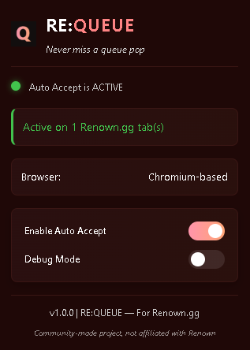
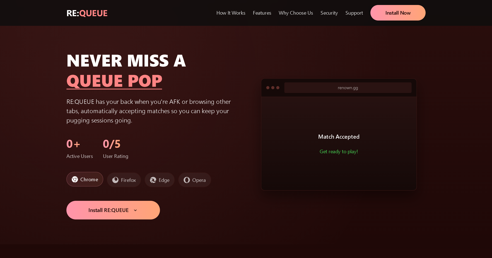

# RE:QUEUE

A browser extension that automatically accepts match queues when they appear on Renown.gg, even when you're not actively on that tab. Built for serious Counter-Strike players who never want to miss a match on the Renown platform.

> **Never miss a queue pop. Always in the game.**

## About

RE:QUEUE is a community-made project created by Counter-Strike players, for Counter-Strike players. It is specifically designed to work with the Renown.gg platform but is not affiliated with, endorsed by, or officially connected to Renown.gg in any way.

## Features

- Automatically accepts queue matches on Renown.gg the moment the "Accept" button appears
- Works seamlessly in the background, even when you're browsing other tabs or AFK
- Compatible with all major browsers (Chrome, Firefox, Edge, Opera)
- Ultra-responsive with both polling and mutation detection
- Sleek, modern interface with gradient styling and toggle controls
- Debug mode for advanced users

## Screenshots

### Extension Popup


### Landing Page


## Installation

### Chrome
1. Visit the [Chrome Web Store page](https://chromewebstore.google.com/detail/hdpeiagpjckedimngnejdbnikbbbhbfi/preview) and click "Add to Chrome"
2. Alternatively, download or clone this repository to your computer
3. Open Google Chrome
4. Navigate to `chrome://extensions/`
5. Enable "Developer mode" by toggling the switch in the top-right corner
6. Click "Load unpacked" and select the folder containing the extension files
7. The RE:QUEUE icon should now appear in your Chrome toolbar

### Firefox
1. Visit the [Firefox Add-ons page](https://addons.mozilla.org/en-GB/firefox/addon/re-queue/) and click "Add to Firefox"
2. Alternatively, download or clone this repository to your computer
3. Open Firefox
4. Navigate to `about:debugging#/runtime/this-firefox`
5. Click "Load Temporary Add-on..."
6. Select the `manifest.json` file from the extension folder
7. The extension will be installed temporarily (until Firefox is restarted)

### Edge
1. Visit the [Edge Add-ons page](https://chromewebstore.google.com/detail/hdpeiagpjckedimngnejdbnikbbbhbfi/preview) and click "Get"
2. Alternatively, download or clone this repository to your computer
3. Open Microsoft Edge
4. Navigate to `edge://extensions/`
5. Turn on "Developer mode" using the toggle in the bottom-left
6. Click "Load unpacked" and select the extension folder
7. The RE:QUEUE icon should now appear in your Edge toolbar

### Opera
1. Visit the [Opera Add-ons page](https://chromewebstore.google.com/detail/hdpeiagpjckedimngnejdbnikbbbhbfi/preview) and click "Add to Opera"
2. Alternatively, download or clone this repository to your computer
3. Open Opera
4. Navigate to `opera://extensions`
5. Enable "Developer mode" in the top-right corner
6. Click "Load unpacked" and select the extension folder
7. The RE:QUEUE icon should now appear in your Opera toolbar

## Usage

1. Click the RE:QUEUE icon in your browser toolbar to open the control panel
2. The extension is enabled by default
3. Toggle the "Enable Auto Accept" switch to turn the functionality on or off
4. Receive visual confirmation when the extension is active on Renown.gg tabs

### Status Indicators

- Green indicator: RE:QUEUE is active and monitoring for queue prompts
- Red indicator: RE:QUEUE is disabled
- Domain status: Shows if Renown.gg tabs are detected

### Debug Mode

If you encounter issues or want to see what's happening behind the scenes, enable Debug Mode in the control panel. This will log detailed information to the browser console.

## How It Works

RE:QUEUE operates using advanced techniques to ensure you never miss a match on Renown.gg:

1. Monitors Renown.gg for the appearance of the "Accept" button in match queues
2. Uses dual detection methods (mutation observers + polling) for maximum reliability
3. Automatically clicks the button when it appears, with browser-specific optimizations
4. Runs efficiently in the background while you focus on other tasks or are AFK

## Permissions

This extension requires the following permissions:

- **storage**: To save your settings and preferences
- **tabs**: To detect and interact with Renown.gg tabs
- **scripting**: To inject content scripts when needed
- **Access to Renown.gg**: To detect and click the "Accept" button

## Browser Compatibility Notes

- **Chrome/Edge/Opera**: Full functionality available on Chromium-based browsers
- **Firefox**: Slightly different implementation but identical functionality
  - Firefox requires explicit host permissions confirmation
  - Background scripts function differently in Firefox

## Quality Assurance

RE:QUEUE is built with quality and reliability in mind. Our comprehensive testing suite ensures that every feature works correctly across all supported browsers:

- **Unit Tests**: Over 90% code coverage for all core functionality
- **Integration Tests**: Communication between different extension components is thoroughly tested
- **End-to-End Tests**: Automated browser testing ensures the extension works in real browser environments
- **Cross-Browser Testing**: Dedicated tests for Chrome, Firefox, Edge, and Opera
- **Manual Testing Checklist**: Final verification before each release
- **Continuous Integration**: All tests are automatically run on code changes

For developers looking to contribute, check out the `tests/` directory to understand our testing approach and requirements.

## Known Issues

- The extension will only work on Renown.gg
- Browser energy-saving features may affect background operation during extended periods of inactivity
- Firefox temporary installations are removed when the browser is restarted

## Troubleshooting

If RE:QUEUE isn't working as expected:

1. Ensure the extension is enabled (green indicator in the control panel)
2. Verify you have Renown.gg tabs open
3. Enable Debug Mode and check the browser console for diagnostic information
4. Try refreshing the Renown.gg tabs
5. Reinstall the extension if necessary

### Browser-Specific Troubleshooting

- **Firefox**: Check that host permissions have been approved in Firefox settings
- **Chrome/Edge/Opera**: Verify the extension isn't being managed by enterprise policies

## Privacy

RE:QUEUE respects your privacy:
- No data collection or external transmission
- No analytics or tracking
- Operates only on Renown.gg website
- Only interacts with the "Accept" button element

For more details, see [PRIVACY.md](PRIVACY.md).

## Credits

- Icons: Designed by Kirby Wu from The Noun Project, licensed under [CC BY-3.0 Attribution License](https://creativecommons.org/licenses/by/3.0/)

## License

This project is open-source software.

## Development

### Cross-Browser Development (2025 Best Practices)

RE:QUEUE follows the 2025 best practices for cross-browser extension development:

1. **Browser Extension Polyfill**: Uses Mozilla's [webextension-polyfill](https://github.com/mozilla/webextension-polyfill) for compatibility
2. **Progressive Feature Enhancement**: Core functionality works across all browsers, with browser-specific features added when available
3. **Non-persistent Background Scripts**: Uses event-based service workers for better performance and battery life
4. **Feature Detection**: Checks for API availability before using browser-specific features
5. **Manifest V3 Compliance**: Built on Manifest V3 standards with browser-specific adjustments

### Project Structure

```
re-queue/
├── manifest.json        # Extension configuration
├── background.js        # Service worker for background processes
├── content.js           # Content script that runs on pages
├── popup.html           # Extension popup UI
├── popup.js             # JavaScript for the popup UI
├── browser-polyfill.js  # WebExtension API Polyfill for cross-browser support
├── images/              # Extension icons
│   ├── icon16.png
│   ├── icon48.png
│   ├── icon128.png
│   └── icon128_disabled.png
├── frontend/            # Landing page files
│   ├── index.html       # Landing page HTML 
│   └── assets/          # Landing page assets
├── tests/               # Comprehensive testing suite
│   ├── unit/            # Unit tests
│   ├── integration/     # Integration tests
│   ├── e2e/             # End-to-end tests
│   ├── mocks/           # Test mocks and fixtures
│   └── manual/          # Manual testing checklist
└── README.md            # This documentation
```

### Building and Packaging

For cross-browser distribution, the extension can be packaged for each browser:

- **Chrome/Edge/Opera**: `.zip` file or Chrome Web Store deployment
- **Firefox**: `.xpi` file signed through Mozilla's Add-on Developer Hub

You can use [web-ext](https://github.com/mozilla/web-ext) for testing and building packages:

```bash
# Install dependencies
npm install

# Run tests
npm test

# Package extensions
npm run build:all

# Test in Firefox
npm run web-ext -- run
```

### Contributing

Contributions are welcome! Please feel free to submit a Pull Request. Before submitting, please ensure that:

1. All tests pass (`npm test`)
2. New features include appropriate tests
3. Code follows the project style guidelines
4. Documentation is updated as needed

## Disclaimer

This extension is a fan-made tool created for the Renown.gg community. It is not affiliated with, endorsed by, or officially connected to Renown.gg or its parent company in any way. Use at your own risk.

---

*RE:QUEUE — Never miss a queue pop*
